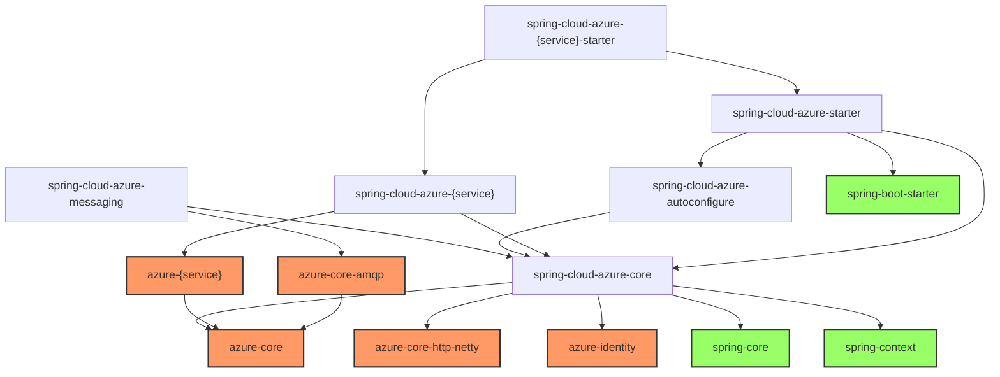
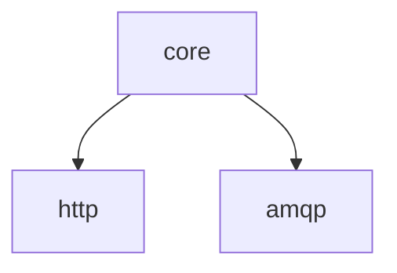
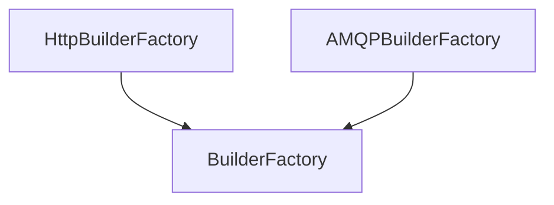

# spring-cloud-azure

## L1 support features

* auto configuration sdk clients

## L2 support features

* spring data
* spring security
* spring integration
* spring cloud stream

## Service Builder Design

There are two kinds of sdk client libraries from transport perspective, and they share some common infrastructure from the core, for example like

* azure environment configuration
* proxy config

Spring design
